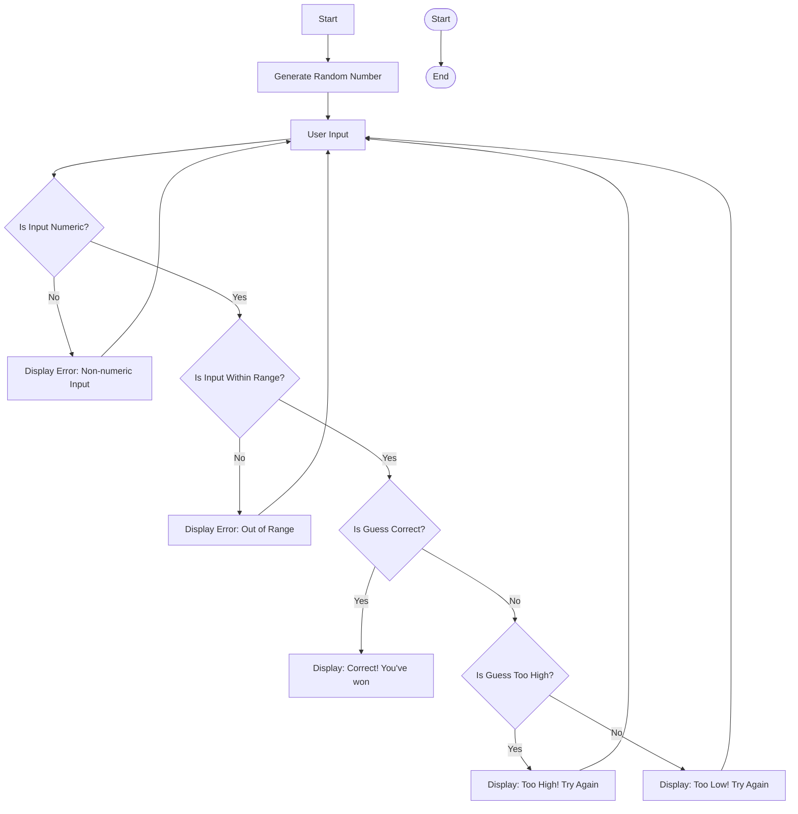

```mermaid
flowchart TD
    A[Start] --> B[Generate Random Number]
    B --> C[User Input]
    C --> D{Is Input Numeric?}
    D -- No --> E[Display Error: Non-numeric Input]
    E --> C
    D -- Yes --> F{Is Input Within Range?}
    F -- No --> G[Display Error: Out of Range]
    G --> C
    F -- Yes --> H{Is Guess Correct?}
    H -- Yes --> I[Display: Correct! You've won]
    H -- No --> J{Is Guess Too High?}
    J -- Yes --> K[Display: Too High! Try Again]
    K --> C
    J -- No --> L[Display: Too Low! Try Again]
    L --> C

Start([Start]) --> End([End])
```